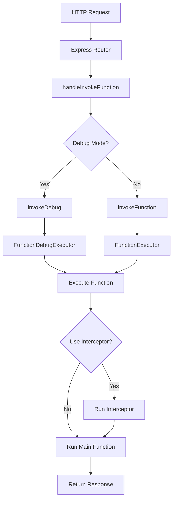

# LAF Runtime & Cloud SDK 분석 문서

## 개요
LAF(Life After Faasd)는 서버리스 클라우드 함수 플랫폼으로, Node.js 런타임과 Cloud SDK를 통해 개발자가 쉽게 백엔드 기능을 구현할 수 있도록 지원합니다.

## 1. Runtime (runtimes/nodejs)

### 1.1 아키텍처 개요
Node.js 런타임은 LAF의 핵심 실행 환경으로, 클라우드 함수를 샌드박스 환경에서 안전하게 실행합니다.

```
runtimes/nodejs/
├── src/
│   ├── index.ts           # Express 서버 진입점
│   ├── handler/           # HTTP 요청 핸들러
│   │   ├── invoke.ts      # 함수 호출 처리
│   │   ├── db-proxy.ts    # 데이터베이스 프록시
│   │   ├── router.ts      # API 라우팅
│   │   └── openapi.ts     # OpenAPI 문서 생성
│   ├── support/           # 지원 모듈
│   │   ├── engine/        # 함수 실행 엔진
│   │   ├── cloud-sdk.ts   # SDK 인스턴스 생성
│   │   ├── ws.ts          # WebSocket 지원
│   │   └── token.ts       # JWT 토큰 처리
│   ├── db.ts              # MongoDB 연결 관리
│   └── storage-server.ts  # 스토리지 서버
```

### 1.2 주요 컴포넌트

#### Express 서버 (src/index.ts)
- **포트**: Config.PORT에서 설정된 포트로 실행
- **미들웨어**:
  - CORS 설정 (모든 origin 허용)
  - JSON/URL-encoded/Raw/XML 파싱
  - Bearer 토큰 파싱
  - Request ID 생성 및 추적
- **WebSocket 업그레이드**: LSP와 일반 WebSocket 연결 지원

#### 함수 실행 엔진 (src/support/engine/)
- **FunctionExecutor**: 클라우드 함수 실행 관리
  - 일반 실행 모드
  - 디버그 모드 (소스맵 지원)
  - 인터셉터 패턴으로 미들웨어 구현
- **FunctionModule**: 함수 모듈 캐싱 및 관리
- **FunctionCache**: 컴파일된 함수 코드 캐싱
- **Console**: 함수 실행 중 로깅 처리

#### 함수 호출 핸들러 (src/handler/invoke.ts)
```typescript
// 일반 함수 호출
async function invokeFunction(ctx: FunctionContext, useInterceptor: boolean)

// 디버그 함수 호출 (개발 모드)
async function invokeDebug(ctx: FunctionContext, useInterceptor: boolean)
```

**특징**:
- 디버그 모드: `x-laf-develop-token` 헤더로 활성화
- 함수 데이터 압축: pako를 사용한 gzip 압축
- 실행 시간 측정 및 로그 수집
- 인터셉터 지원 (`__interceptor__` 함수)

#### 데이터베이스 연결 (src/db.ts)
- MongoDB 클라이언트 싱글톤 패턴
- 연결 준비 상태 Promise 제공
- Database Proxy를 통한 정책 기반 접근 제어

### 1.3 보안 기능
- JWT 토큰 기반 인증
- 함수별 HTTP 메소드 제한
- 트리거 모드 별도 인증
- 개발 토큰을 통한 디버그 모드 접근 제어

## 2. Cloud SDK (packages/cloud-sdk)

### 2.1 패키지 구조
```
packages/cloud-sdk/
├── src/
│   ├── index.ts              # 메인 진입점
│   ├── cloud.ts              # Cloud 클래스 구현
│   ├── cloud.interface.ts   # 인터페이스 정의
│   ├── storage.ts            # 스토리지 API
│   └── util.ts               # 유틸리티 함수
```

### 2.2 Cloud 클래스 API

#### 데이터베이스 접근
```typescript
// Database-QL 인스턴스 반환
cloud.database(): Db

// MongoDB 네이티브 드라이버 직접 접근
cloud.mongo: {
  client: MongoClient,
  db: Db
}
```

#### 함수 호출
```typescript
// 다른 클라우드 함수 호출 (deprecated)
cloud.invoke(name: string, param?: any): Promise<any>
```

#### 토큰 처리
```typescript
// JWT 토큰 생성
cloud.getToken(payload: any, secret?: string): string

// JWT 토큰 파싱
cloud.parseToken(token: string, secret?: string): any | null
```

#### 스토리지 접근
```typescript
// 버킷 접근
const bucket = cloud.storage.bucket('my-bucket')

// 파일 작업
await bucket.readFile('file.txt')
await bucket.writeFile('file.txt', content)
await bucket.deleteFile('file.txt')
await bucket.listFiles({ Prefix: 'folder/' })

// URL 생성
bucket.externalUrl('file.txt')
await bucket.getUploadUrl('file.txt', 3600)
await bucket.getDownloadUrl('file.txt', 3600)
```

#### 기타 기능
```typescript
// WebSocket 연결 목록
cloud.sockets: Set<WebSocket>

// 현재 앱 ID
cloud.appid: string

// 공유 메모리 (deprecated)
cloud.shared: Map<string, any>

// 환경 변수 (deprecated, process.env 사용 권장)
cloud.env
```

### 2.3 CloudStorage 클래스

#### S3 호환 API
- AWS SDK v3 사용 (@aws-sdk/client-s3)
- 내부/외부 엔드포인트 분리
  - 내부: 런타임 내부 통신용
  - 외부: 클라이언트 접근용

#### 주요 메소드
```typescript
class CloudStorageBucket {
  // 파일 읽기
  readFile(filename: string, options?): Promise<GetObjectCommandOutput>
  
  // 파일 쓰기
  writeFile(filename: string, body: string | Buffer | Readable, options?): Promise<PutObjectCommandOutput>
  
  // 파일 삭제
  deleteFile(filename: string, options?): Promise<DeleteObjectCommandOutput>
  
  // 파일 목록
  listFiles(options?): Promise<ListObjectsCommandOutput>
  
  // URL 생성
  externalUrl(filename: string): string
  internalUrl(filename: string): string
  getUploadUrl(filename: string, expiresIn?: number): Promise<string>
  getDownloadUrl(filename: string, expiresIn?: number): Promise<string>
}
```

## 3. Runtime과 SDK의 통합

### 3.1 초기화 과정

1. **런타임 시작** (runtimes/nodejs/src/index.ts)
   ```typescript
   // createCloudSdk를 글로벌 객체에 등록
   globalThis.createCloudSdk = createCloudSdk
   ```

2. **SDK 인스턴스 생성** (runtimes/nodejs/src/support/cloud-sdk.ts)
   ```typescript
   export function createCloudSdk() {
     const cloud: CloudSdkInterface = {
       database: () => getDb(DatabaseAgent.accessor),
       invoke: invokeInFunction,
       shared: _shared_preference,
       getToken: getToken,
       parseToken: parseToken,
       mongo: {
         client: DatabaseAgent.client,
         db: DatabaseAgent.db
       },
       sockets: WebSocketAgent.clients,
       appid: Config.APPID,
       storage: null
     }
     return cloud
   }
   ```

3. **SDK에서 런타임 구현 사용** (packages/cloud-sdk/src/cloud.ts)
   ```typescript
   private get cloud(): CloudSdkInterface {
     if (globalThis.createCloudSdk && !Cloud.create) {
       Cloud.create = globalThis.createCloudSdk
     }
     if (!this._cloud) {
       this._cloud = Cloud.create()
     }
     return this._cloud
   }
   ```

### 3.2 함수 실행 흐름



### 3.3 데이터 흐름

1. **요청 컨텍스트 생성**
   ```typescript
   const ctx: FunctionContext = {
     __function_name: name,
     requestId: req.requestId,
     query: req.query,
     body: req.body,
     headers: req.headers,
     method: req.method,
     auth: req['auth'],
     user: req.user,
     request: req,
     response: res
   }
   ```

2. **함수 실행**
   - 함수 캐시에서 모듈 로드
   - 인터셉터 체크 및 실행
   - 메인 함수 실행
   - 결과 반환

3. **리소스 접근**
   - 함수는 `@scraping-run/cloud` import를 통해 SDK 사용
   - SDK는 런타임이 제공하는 실제 구현 호출
   - 데이터베이스, 스토리지, WebSocket 등 리소스 접근

## 4. 개발 모드 지원

### 4.1 디버그 기능
- 실시간 함수 코드 전송 및 실행
- 소스맵 지원으로 디버깅 가능
- 실행 로그 수집 및 반환
- 실행 시간 측정

### 4.2 Hot Reload
- 모듈 핫 리로드 지원 (src/support/module-hot-reload.ts)
- 함수 캐시 자동 갱신
- 개발 중 빠른 반복 작업 가능

### 4.3 LSP (Language Server Protocol)
- TypeScript 언어 서버 통합
- 코드 자동 완성 및 타입 체크
- WebSocket을 통한 LSP 통신

## 5. 성능 최적화

### 5.1 캐싱 전략
- **함수 캐시**: 컴파일된 함수 코드 메모리 캐싱
- **모듈 캐시**: require된 모듈 재사용
- **공유 메모리**: 함수 간 데이터 공유 (Map)

### 5.2 연결 풀링
- MongoDB 연결 풀 관리
- WebSocket 연결 재사용
- S3 클라이언트 싱글톤 패턴

### 5.3 요청 처리
- 요청 크기 제한 (Config.REQUEST_LIMIT_SIZE)
- 스트리밍 지원 (파일 업/다운로드)
- 비동기 처리 최적화

## 6. 보안 고려사항

### 6.1 인증 및 권한
- JWT 토큰 기반 인증
- 개발 토큰과 트리거 토큰 분리
- 함수별 HTTP 메소드 제한

### 6.2 샌드박싱
- 함수는 격리된 환경에서 실행
- 리소스 접근 제한 (database-proxy)
- 환경 변수를 통한 설정 격리

### 6.3 데이터 보호
- 디버그 데이터 압축 및 인코딩
- Signed URL을 통한 임시 접근 권한
- 요청 ID를 통한 추적 및 로깅

## 7. 확장성

### 7.1 모듈화 구조
- 핸들러, 엔진, 지원 모듈 분리
- 인터페이스 기반 설계
- 플러그인 가능한 아키텍처

### 7.2 다중 런타임 지원
- 현재 Node.js 런타임
- 향후 다른 언어 런타임 추가 가능
- 런타임별 SDK 구현 가능

### 7.3 스케일링
- Kubernetes 기반 배포
- 함수별 독립적 스케일링
- 상태 비저장 설계

## 8. 모니터링 및 로깅

### 8.1 로깅 시스템
- Console 클래스를 통한 구조화된 로깅
- 디버그 모드 로그 수집
- 요청 ID 기반 추적

### 8.2 메트릭
- 함수 실행 시간 측정
- 요청 처리 통계
- 리소스 사용량 모니터링

## 9. 결론

LAF의 런타임과 Cloud SDK는 긴밀하게 통합되어 개발자가 쉽게 서버리스 애플리케이션을 구축할 수 있도록 지원합니다. 주요 특징은:

1. **간단한 API**: 직관적인 SDK API로 빠른 개발 가능
2. **강력한 기능**: 데이터베이스, 스토리지, WebSocket 등 풀스택 기능
3. **개발자 경험**: 디버그 모드, Hot Reload, LSP 지원
4. **확장성**: 모듈화된 구조로 확장 가능
5. **보안**: 샌드박싱, 토큰 인증, 리소스 격리

이러한 설계를 통해 LAF는 Firebase나 Supabase와 같은 상용 서비스의 오픈소스 대안으로서 완성도 높은 서버리스 플랫폼을 제공합니다.